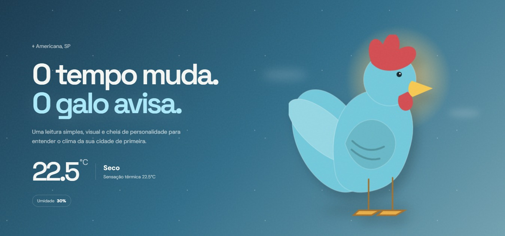
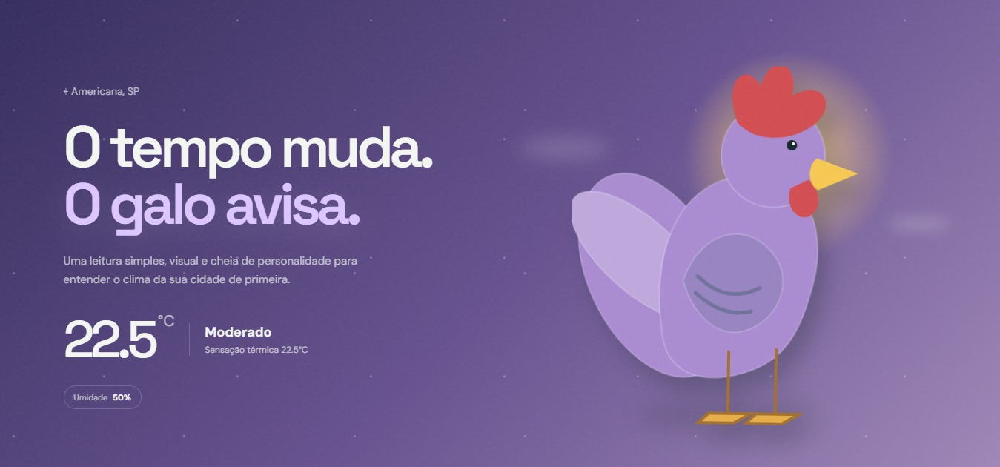
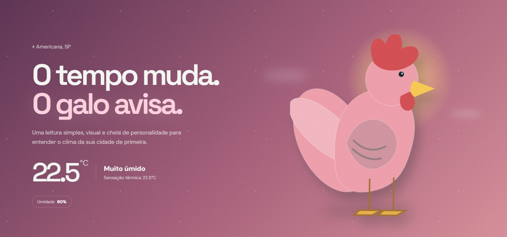

# 🐓 Galo do Tempo Inteligente

O Galo do Tempo Inteligente é uma versão tecnológica do tradicional Galo do Tempo, utilizando conceitos de **Internet das Coisas (IoT)** e **Computação em Nuvem** para monitorar as condições de temperatura e umidade do ambiente.

## 🎯 Objetivo

Demonstrar, na prática, a integração entre **hardware, sensores, conectividade, armazenamento em nuvem e desenvolvimento web**, transformando um objeto tradicional em uma solução tecnológica interativa.

## 🚀 Funcionalidades Implementadas

- **Monitoramento de Temperatura:** Coleta da temperatura do ambiente utilizando o sensor DHT11.
- **Monitoramento de Umidade:** Identificação da umidade do ambiente em tempo real.
- **Conexão Wi-Fi:** O ESP32 envia os dados coletados para a nuvem.
- **Armazenamento na Nuvem:** Os dados são enviados e armazenados na plataforma ThingSpeak.
- **Dashboard Web:** Site desenvolvido em PHP para consultar e apresentar os dados coletados.
- **Representação Visual:** O Galo altera sua cor automaticamente de acordo com o nível de umidade:
  - 💙 **0% – 39%:** Ambiente seco
  - 💜 **40% – 69%:** Umidade moderada
  - 💗 **70% – 100%:** Ambiente muito úmido
- **Visualização dos Dados:** Exibição das informações coletadas pelo sensor de forma simples e intuitiva.
  
## 🔧 Componentes Utilizados

- ESP32
- Sensor DHT11
- Protoboard
- Jumpers

## 📸 Prints do Sistema

  
  
  

